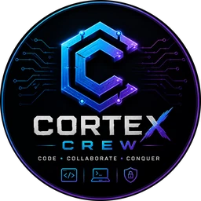

<div align="center">



# Cortex Crew

**Code · Collaborate · Conquer**

The official site of Cortex Crew — a competition team at
Daffodil International University, Dhaka.

[](https://cortex-crew.vercel.app)


</div>

---

## About

Cortex Crew builds working systems and takes them on stage. In 2026 the team
entered six project showcases and hackathons and placed in every one — one
championship, one runners-up, and four finals — across Daffodil International
University, IEEE, BRAC University, and CloudCamp Bangladesh. The team is now
moving into Capture the Flag competition.

This repository holds the source for the team's public site: a single-page
application presenting the record, the projects behind it, the people, and
what comes next.

**→ [cortex-crew.vercel.app](https://cortex-crew.vercel.app)**

## Highlights

- **Zero-dependency UI.** Two runtime packages — `react` and `react-dom`. No
  icon library, animation library, router, or class-name utilities. The icon
  set, scroll reveals, and component kit are all hand-built.
- **74 KB of JavaScript, gzipped.** Well inside a mobile budget.
- **Perfect Lighthouse scores** for accessibility, best practices, and SEO.
- **No layout shift.** CLS measures 0.00 — every image carries intrinsic
  dimensions and the webfonts have metric-matched fallbacks.
- **Motion is opt-in.** Nothing animates at rest, and the entire scroll-reveal
  mechanism is gated behind `prefers-reduced-motion`.
- **Content is data.** Every word on the page lives in one typed module, so the
  site updates without touching a component.

## Performance

Measured on the production build — mobile profile, Lighthouse and Chrome
DevTools traces.

| Metric | Result |
| --- | --- |
| Accessibility | **100** |
| Best Practices | **100** |
| SEO | **100** |
| Largest Contentful Paint | **264 ms** |
| Cumulative Layout Shift | **0.00** |
| JavaScript (gzipped) | **74.6 KB** |
| CSS (gzipped) | **8.1 KB** |
| Runtime dependencies | **2** |

## Tech stack

| Layer | Choice |
| --- | --- |
| Build | Vite 8 |
| UI | React 19 + TypeScript |
| Styling | Tailwind CSS 4 (CSS-first `@theme` tokens) |
| Package manager | bun |
| Linting | oxlint |
| Image pipeline | Python + Pillow |
| Hosting | Vercel |

## Getting started

Requires [bun](https://bun.sh). Python 3 with Pillow is needed only to
regenerate images.

```bash
git clone https://github.com/jdomin72/cortex-crew.git
cd cortex-crew
bun install
bun run dev
```

The site runs at `http://localhost:5173`.

## Scripts

| Command | Description |
| --- | --- |
| `bun run dev` | Start the dev server with hot reload |
| `bun run build` | Type-check and build to `dist/` |
| `bun run preview` | Serve the production build locally |
| `bun run lint` | Run oxlint |
| `bun run media` | Regenerate optimised images |

## Project structure

```
src/
├─ data/            typed site content and models
├─ lib/             class names, intersection observer, formatting
├─ components/
│  ├─ ui/           Reveal · Img · Avatar · Badge · Button · Card · Icon
│  └─ sections/     Hero · Pillars · Achievements · Timeline
│                   Projects · Team · CTF · Contact
└─ index.css        design tokens and utilities
scripts/            image optimisation pipeline
public/media/       generated WebP assets
```

## Deployment

Deployed to Vercel as a static build. `vercel.json` configures the install
command, build command, output directory, long-lived asset caching, and
security headers.

```bash
npx vercel --prod
```

## License

© 2026 Cortex Crew. All rights reserved.

The source is public for reference. The Cortex Crew name, logo, brand, and
photography are not licensed for reuse.

---

<div align="center">

**[Facebook](https://facebook.com/teamcortexcrew)** · Dhaka, Bangladesh

*We don't just participate, we make an impact.*

</div>
